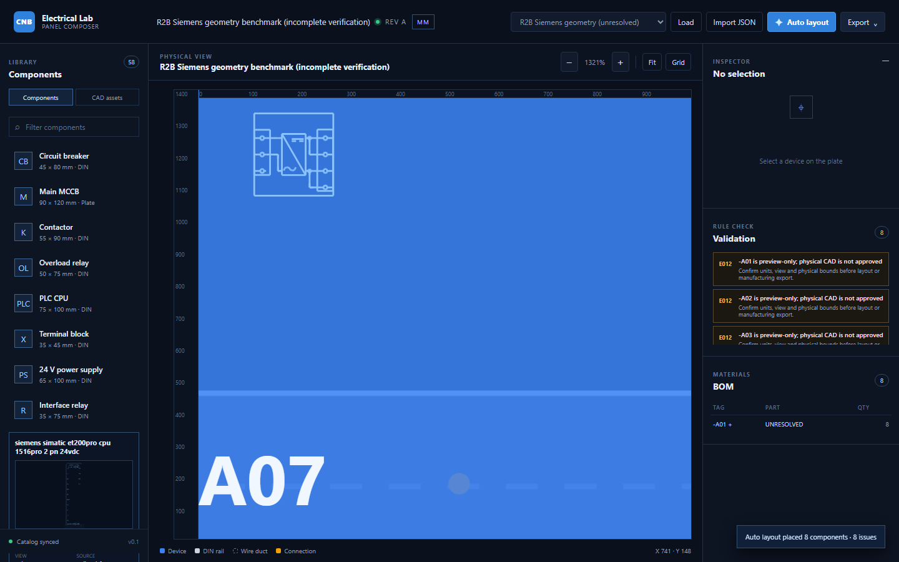
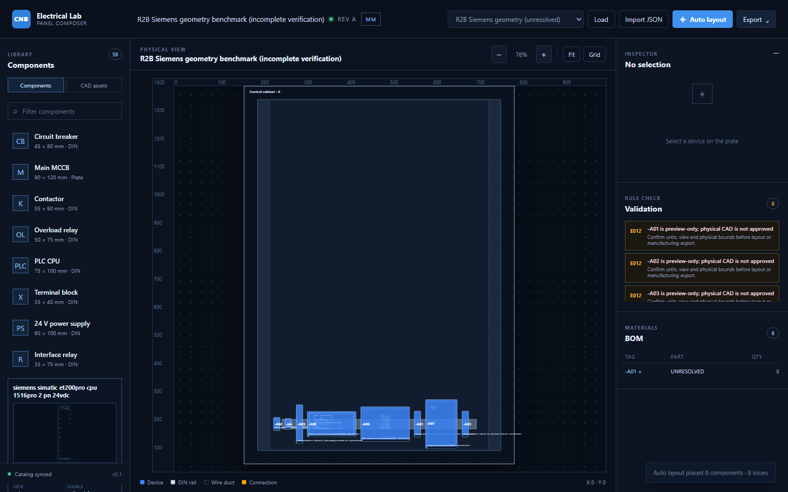

# R2B Verified Siemens Report

## 1. Kết quả xác minh

Đã nghiên cứu 8 asset Siemens từ đúng `catalog/`. Industry Mall và support
chính thức trả HTTP 403 trong môi trường chạy, vì vậy **0 sản phẩm được gắn
vendor-verified**, 0 kích thước vendor được persist và 8 sản phẩm giữ trạng
thái `unresolved`/`test`. Không có MPN nào được suy diễn.

Nguồn truy nguyên và blocker nằm tại `evidence/r2b/vendor-sources.json`; hồ sơ
từng candidate nằm trong `docs/r2/verified-components/`.

## 2. Hình học CAD thật

`scripts/build_r2b_benchmark.py` parse LINE, LWPOLYLINE, POLYLINE, ARC, CIRCLE
và INSERT virtual entities từ DXF catalog thành 8 vector cache. Cache giữ
SHA256/path nguồn, bounds và primitive geometry. Collision/layout dùng
`PhysicalFootprint`; renderer/exporter dùng `cad_geometry_ref` riêng.

DXF xuất thật có 12,847 entities: 5,752 LINE, 7,051 ARC, 27 CIRCLE và 17 TEXT;
ezdxf reopen/audit PASS, bounds 1000 x 1400 mm, layers gồm
`COMPONENT_OUTLINE`, `COMPONENT_DETAIL`, `DEVICE_TAG`, `PART_REF`.

Ảnh này cho thấy các đường nội bộ lấy từ DXF, không chỉ rectangle + cross. Tuy
nhiên đây vẫn là preview catalog chưa xác minh physical scale.

## 3. Benchmark tủ

- 8 Siemens candidate devices, 7 functional groups, 6 meaningful topology edges.
- 1 DIN rail và 2 vertical ducts; heuristic/solver overlap = 0 và validation = PASS.
- Heuristic khoảng 4 ms; CP-SAT `OPTIMAL` khoảng 50 ms trên máy chạy.
- Lock + regenerate giữ nguyên chính xác tọa độ thiết bị đã khóa.

Topology là PSU -> PLC CPU -> I/O/communication/drive, I/O -> field terminals,
PLC -> control relay; không còn chain tuần tự giả của R2A.

## 4. Failures và kết luận

Chưa thể gọi R2B là verified benchmark vì thiếu truy cập nguồn Siemens và thiếu
exact MPN/dimensions. Các source bbox declared-mm lớn như drawing-sheet hoặc
không có order number bị giữ `scaled-layout-symbol`/`unresolved`, không stretch
âm thầm thành engineering truth.

**Kết luận: CONTINUE WITH CONDITIONS.** Giữ vector-cache/export pipeline; chỉ
cho phép authoritative panel DXF sau khi reviewer cung cấp Siemens source
accessible hoặc tài liệu nội bộ có traceability và xác nhận ít nhất 5 exact
products.

## 5. Exact numbers

`catalog assets researched = 8`; `exact Siemens products identified = 0`;
`vendor-verified dimensions = 0`; `usable CAD representations = 8`;
`rejected/mismatched = 0`; `unresolved = 8`; `benchmark devices = 8`;
`heuristic violations = 0`; `solver violations = 0`; `DXF reopened = PASS`;
`real CAD geometry survived export = PASS`.
